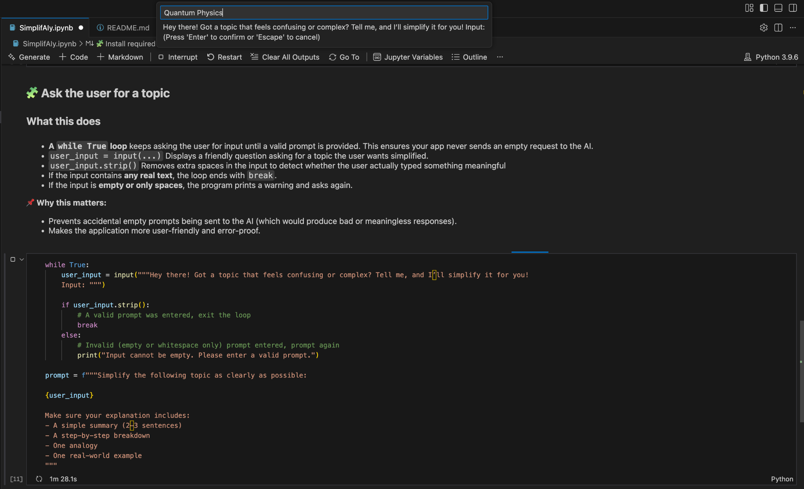
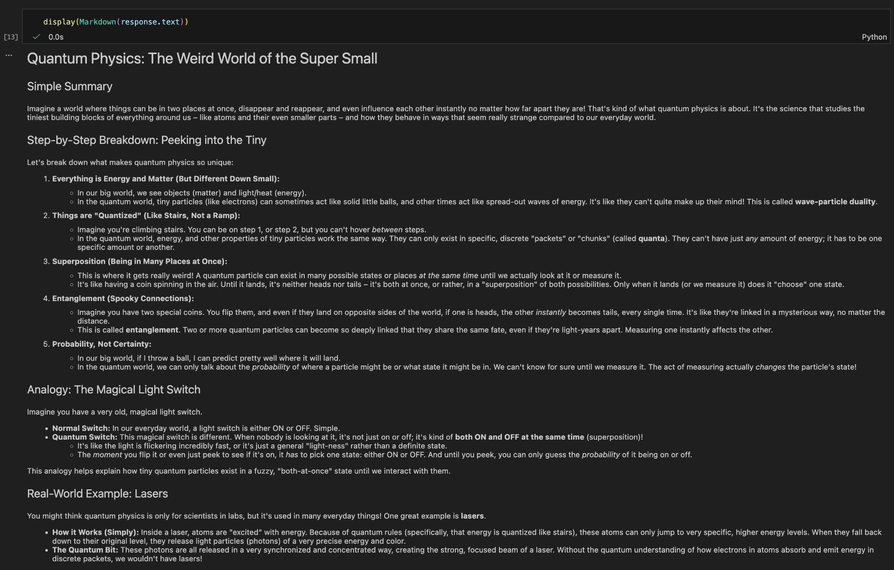

# SimplifAIy
SimplifAIy is an AI-powered assistant that takes any complex topic and explains it in a simple, clear, beginner-friendly way.  
Built using **Google Gemini**, **Python**, and **Jupyter Notebook**, this project demonstrates prompt engineering, secure key handling, and interactive AI experimentation.


## Table of Contents
- [Features](#features)
- [Preview](#preview)
- [Prerequisites](#prerequisites)
- [Setup](#setup)
- [Running in VS Code](#running-in-vs-code)
- [Using the Notebook](#using-the-notebook)
- [Prompt Strategy](#prompt-strategy)
- [Security Notes](#security-notes)
- [Learnings](#learnings)
- [Contributing](#contributing)
- [License](#license)


## Features

- Converts any complex topic into a clear explanation  
- Produces:
  - A 2–3 sentence summary  
  - A step-by-step breakdown  
  - One analogy  
  - One real-world example  
- Validates input to avoid empty prompts  
- Loads API keys securely using `.env`  
- Entire logic runs inside a Jupyter Notebook  
- Perfect for learning AI/ML basics + LLM integration  


## Preview

### Input Prompt


### AI Output



## Prerequisites

Make sure you have these installed on your machine:

- **Python 3.9+**
- **VS Code** (recommended)
- **VS Code Extensions:**
  - Python (Microsoft)
  - Jupyter (Microsoft)

You do *not* need to install any Python packages globally.  
The notebook installs its dependencies internally.


## Setup

### 1. Clone the repository
```bash
git clone https://github.com/tdeva14/SimplifAIy.git
cd SimplifAIy
````

### 2. Create a `.env` file

Inside the project folder, create:

```
.env
```

Add your Gemini API key:

```
GEMINI_API_KEY=your_api_key_here
```

⚠️ **Do NOT commit this file.**
`.env` is already listed in `.gitignore`.


## Running in VS Code

VS Code provides a smooth environment for working with Jupyter notebooks.

### 1. Install VS Code Extensions

* Open VS Code
* Go to **Extensions**
* Install:

  * **Python**
  * **Jupyter**

### 2. Open the Project

```
File → Open Folder → SimplifAIy
```

### 3. Open the Notebook

Click on:

```
SimplifAIy.ipynb
```

### 4. Select Python Interpreter / Kernel

If prompted:

* Choose a Python environment from your system (Anaconda or global Python)

Or click the **kernel selector** at the top right.


## Using the Notebook

### 1. Install dependencies inside the notebook

Run this in the first cell:

```python
!pip install google-genai python-dotenv
```

This installs the required libraries **inside the notebook environment** (not globally).

### 2. Run the cells in order

Use **Shift + Enter** or the Run buttons.

The notebook will:

* Load your API key
* Accept your topic
* Construct a structured prompt
* Fetch a response from Gemini
* Display a clean, formatted explanation


## Prompt Strategy

This project uses a structured template:

```
Simplify the following topic as clearly as possible:

<TOPIC>

Make sure your explanation includes:
- A simple summary (2–3 sentences)
- A step-by-step breakdown
- One analogy
- One real-world example
```

The system prompt ensures:

* Beginner-friendly explanations
* Minimal jargon
* Step-by-step clarity
* Examples + analogies for better understanding


## Security Notes

* API keys live in `.env`
* `.env` must never be committed — it is excluded by `.gitignore`
* The notebook prints `True` after `load_dotenv()` because Jupyter displays the return value
* Adding a semicolon suppresses this output:

```python
load_dotenv();
```


## Learnings

This project demonstrates:

* LLM API usage (Google Gemini)
* Prompt engineering techniques
* Secure environment variable handling
* Input validation loops
* Building beginner-friendly educational AI tools
* Working with Jupyter notebooks in VS Code
* Git + GitHub workflow


## Contributing

Contributions and suggestions are welcome!
Feel free to submit PRs or open issues with ideas for improvements.


## License

This project is licensed under the **MIT License**.

If this project helped you learn or build, consider giving it a ⭐ on GitHub!
